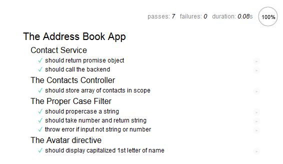
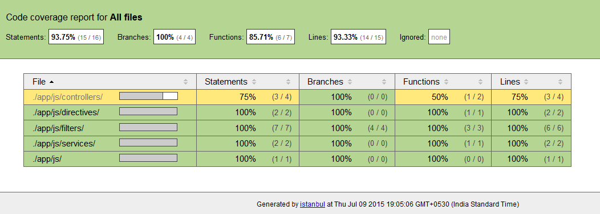

# Angular JS Testing
testing with Angular JS

## Run dev

```
gulp serve
// will run frontend on port 3000 & backend on 5000
```

## Run unit test

```
gulp serve-test ( launched in browser )
karma start ( test with coverage in terminal)
gulp test-browser 
```



## Run Coverage

```
gulp serve-coverage
```



## Run Protractor

```
npm install webdriver-manager -g
webdriver-manager start
gulp protractor
```
